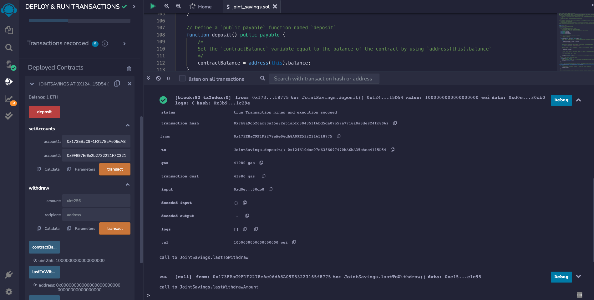
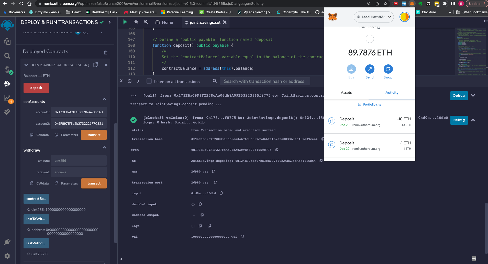
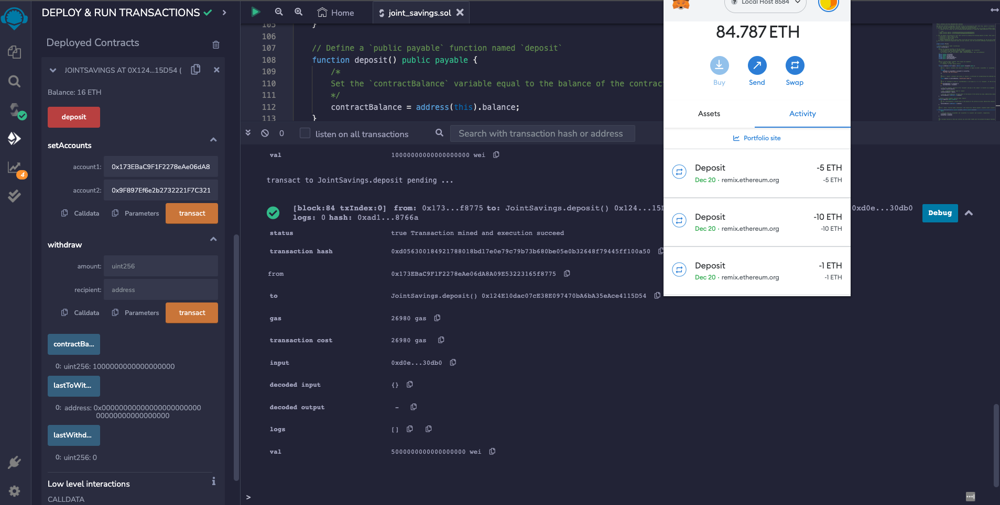
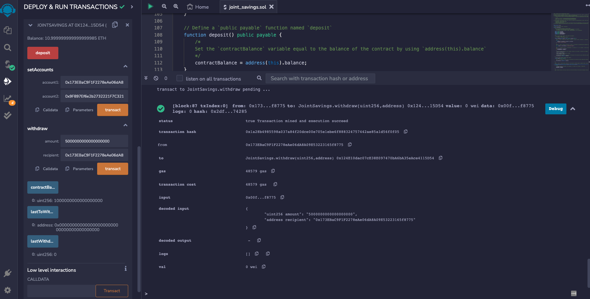
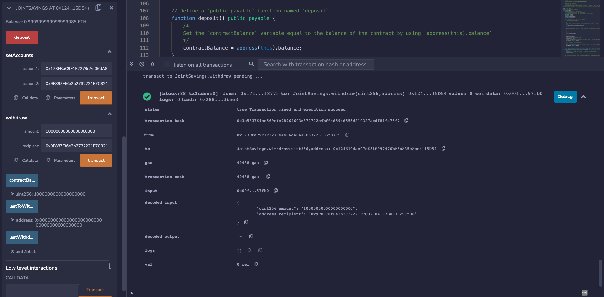
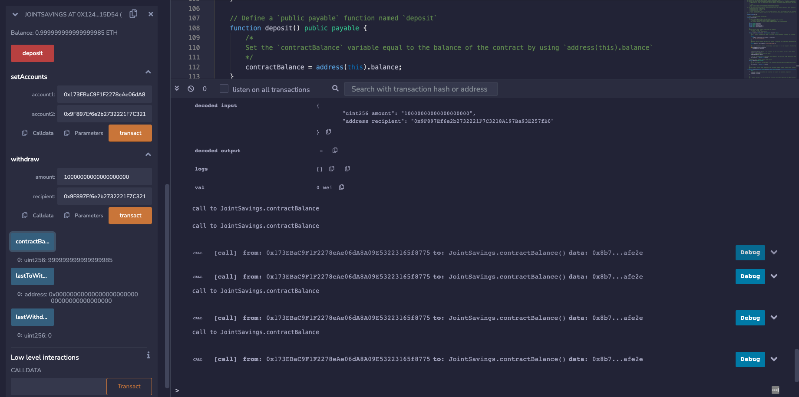

# 20_joint_savings

Screenshots:

### Depost 1 Eth as Wei

### Depost 10 Eth as Wei

### Depost 5 Eth

### Withdraw 5 eth account 1

#### Note - the balance function was not called (it's called later) but the balance is shown.
### Withdraw 10 eth account 2

### Contract Balance after account 2 withdraw
